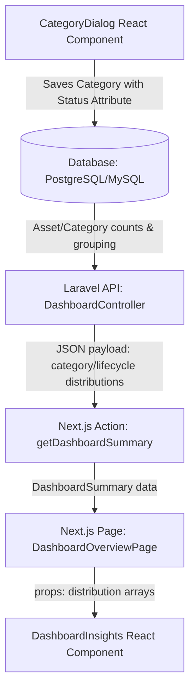

# Design Spec: Real Organization Data & Line Charts for Dashboard Insights

This design document outlines the changes required to replace static mock charts inside the TracerPro overview insights with dynamic, real organization database-driven insights. It also establishes "status" as a mandatory attribute for all asset categories to feed the asset lifecycle chart, using best-practice asset lifecycle stages.

## 1. Objectives & Success Criteria
- **Real Data**: The "Asset Distribution" and "Asset Lifecycle" charts must consume real active organization database records instead of static mock data.
- **Line Chart Representation**: The "Asset Distribution" card must render a dynamic category-wise `LineChart` (Recharts) instead of a simple progress bar list.
- **Mandatory Lifecycle Status**:
  - Enforce a mandatory `status` select attribute for all categories upon creation/modification.
  - Suggest a standard set of lifecycle statuses based on best practices: `["In Stock", "Deployed", "Under Maintenance", "Retired"]`.
  - Use these statuses to feed the "Asset Lifecycle" pie chart insights dynamically.
- **Consistent Seeding**: Seed categories and assets with standard attribute specifications and realistic values.

## 2. Technical Design & Architecture



### 2.1. Backend Aggregation (`tracepro-laravel`)
The `DashboardController` index endpoint will be enhanced to compute and return:
1. **Category Distribution**: Real counts of assets per category.
   ```php
   $categoryDistribution = $org->categories()
       ->withCount('assets')
       ->get()
       ->map(fn($cat) => [
           'name' => $cat->name,
           'units' => $cat->assets_count
       ]);
   ```
2. **Lifecycle Distribution**: Counts of assets per status. The endpoint will query all organization assets, parse their JSON `values` column to read `status` (case-insensitive check), and aggregate the counts.
   ```php
   $assets = $org->assets()->get();
   $lifecycleGroups = $assets->groupBy(function ($asset) {
       $values = $asset->values ?? [];
       $statusKey = collect(array_keys($values))->first(fn($k) => strtolower($k) === 'status');
       return $statusKey ? trim($values[$statusKey]) : 'In Stock';
   });
   $lifecycleDistribution = $lifecycleGroups->map(fn($group, $status) => [
       'name' => $status,
       'value' => $group->count()
   ])->values();
   ```

### 2.2. Database Seeding (`tracepro-laravel`)
- **`DatabaseSeeder.php`** will be updated to seed categories using the object attribute schema rather than simple string arrays.
- Seed attributes list will always include:
  - `barcode`: `{"label": "Barcode", "name": "barcode", "type": "string", "required": true}`
  - `status`: `{"label": "Status", "name": "status", "type": "select", "required": true, "options": ["In Stock", "Deployed", "Under Maintenance", "Retired"]}`
- Assets will be seeded with corresponding random values inside the `values` JSON column (e.g. `'status' => 'Deployed'`).

### 2.3. Frontend Server Action & Types (`tracerpro-new`)
- **`types/domain.ts`**:
  Extend `DashboardSummary` to include:
  ```typescript
  categoryDistribution?: { name: string; units: number }[];
  lifecycleDistribution?: { name: string; value: number }[];
  ```
- **`actions/overview.actions.ts`**:
  Forward `categoryDistribution` and `lifecycleDistribution` from the API response payload.

### 2.4. Frontend Component UI (`tracerpro-new`)
- **`components/dashboard/overview/dashboard-insights.tsx`**:
  - Accept `categoryDistribution`, `lifecycleDistribution`, and `chartData` props.
  - Implement a premium Recharts `LineChart` inside "Asset Distribution":
    - X-Axis: Category names (`name`).
    - Y-Axis: Asset units count (`units`).
    - Monotone line style with gradients and smooth animations.
  - Render the "Asset Lifecycle" `PieChart` using `lifecycleDistribution` with consistent color mappings:
    - `In Stock` $\rightarrow$ Indigo/Blue (`#60A5FA` / `#137fec`)
    - `Deployed` $\rightarrow$ Emerald (`#10B981`)
    - `Under Maintenance` $\rightarrow$ Orange (`#F97316`)
    - `Retired` $\rightarrow$ Slate (`#64748B`)
- **`components/dashboard/project/category-dialog.tsx`**:
  - Automatically add both `barcode` and `status` to default attributes.
  - Require both `barcode` and `status` in Zod validation schema.
  - Mark `status` and `barcode` attributes as `isMandatory` (disallowing delete, key edit, or type edit, but allowing option edit for select types).
