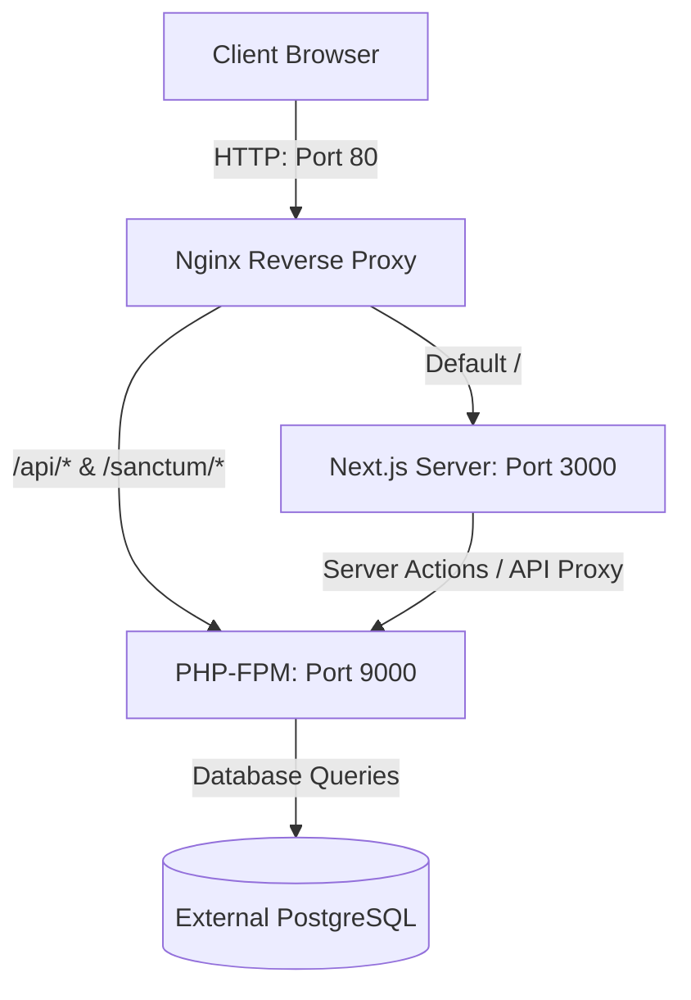

# Design Spec: Unified full stack Docker Containerization

This specification outlines the architecture and implementation details for containerizing both the Next.js frontend (`tracerpro-new`) and the Laravel backend (`tracepro-laravel`) into a single, cohesive Docker image using a multi-stage, multi-process approach.

## Objectives
- Containerize the frontend and backend together in a single Debian-based Docker image.
- Configure Nginx as a reverse proxy to route frontend and backend requests correctly under a single port.
- Use Supervisord to manage the lifecycles of PHP-FPM, Nginx, and the Next.js Node server.
- Connect to an external PostgreSQL database using environment variables.
- Run migrations and cache optimizations during container startup.

## Architecture & Data Flow

---

## File Changes & Configurations

### 1. Dockerfile
**Path**: `/Users/mbp/Desktop/Code/tracepro-laravel/Dockerfile`
A multi-stage Dockerfile that:
1. Builds the Next.js frontend inside a Node environment using `pnpm`.
2. Installs Laravel dependencies using Composer.
3. Sets up the final runtime based on PHP 8.3 FPM, installs Nginx, Node.js (LTS), Supervisor, and system dependencies (PostgreSQL client/libs).
4. Copies config files and entrypoint script.

### 2. Nginx Config
**Path**: `/Users/mbp/Desktop/Code/tracepro-laravel/docker/nginx.conf`
Routes traffic on port 80:
- Proxy passes `/api` and `/sanctum` to PHP-FPM on `127.0.0.1:9000`.
- Proxy passes other routes `/` to Next.js on `127.0.0.1:3000`.

### 3. Supervisor Config
**Path**: `/Users/mbp/Desktop/Code/tracepro-laravel/docker/supervisord.conf`
Monitors and runs:
- `php-fpm`
- `nginx` (daemon off)
- `node` (`next start` on port 3000)

### 4. Entrypoint Script
**Path**: `/Users/mbp/Desktop/Code/tracepro-laravel/docker/entrypoint.sh`
- Waits for database connection to be active.
- Runs `php artisan migrate --force`.
- Runs `php artisan storage:link`.
- Runs `php artisan config:cache` and `php artisan route:cache`.
- Boots `supervisord`.

---

## Verification Plan
- Build the image from `/Users/mbp/Desktop/Code` using:
  `docker build -t tracerpro -f tracepro-laravel/Dockerfile .`
- Run the container locally, passing environmental variables for database connectivity.
- Verify Nginx is routing to the frontend on `/` and backend requests on `/api`.
